# Nuevo_Proyecto_MADS_10913_IDGS10

## Sección 1: Capturas de Pantalla de la creacion del repositorio

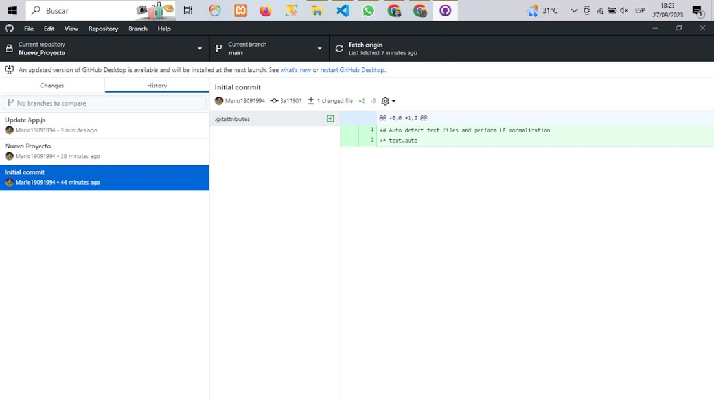

## Sección 2: Capturas de Pantalla de las subidas de infirmación
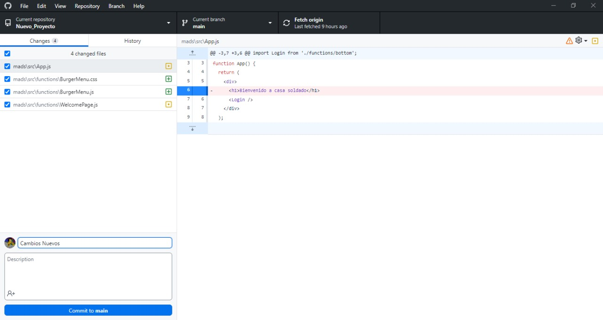
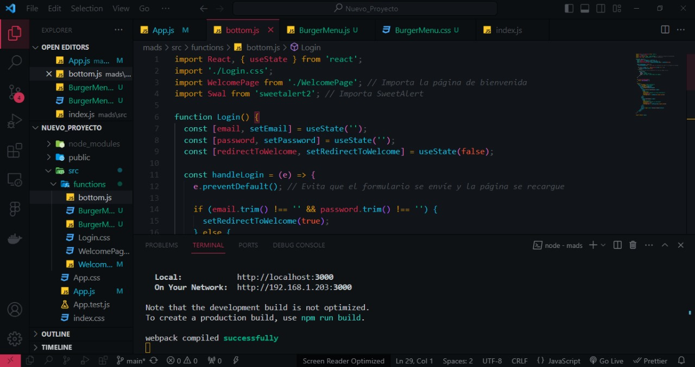
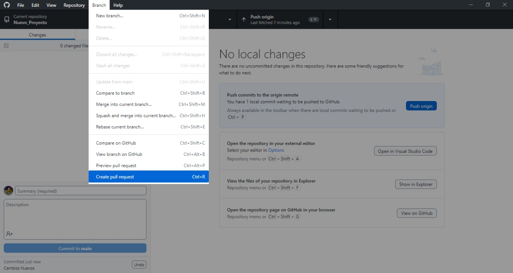
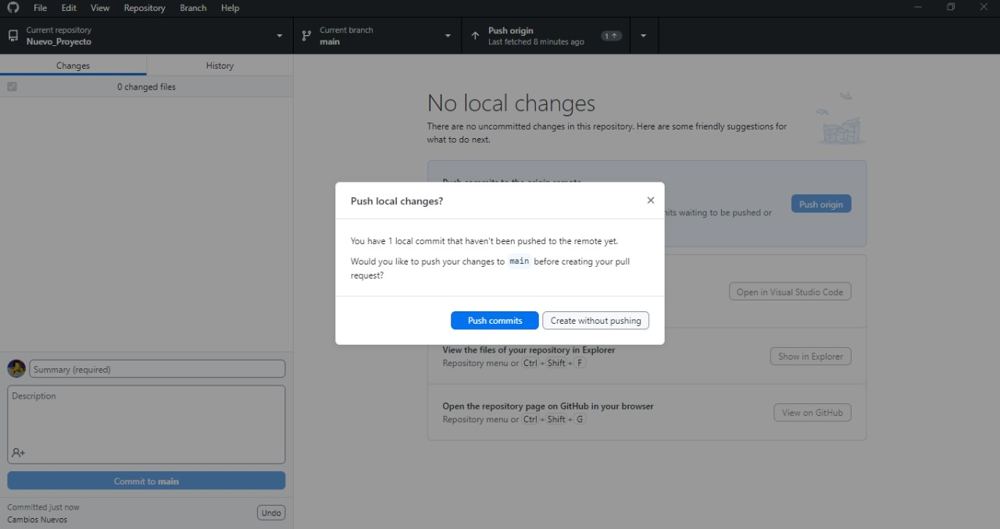
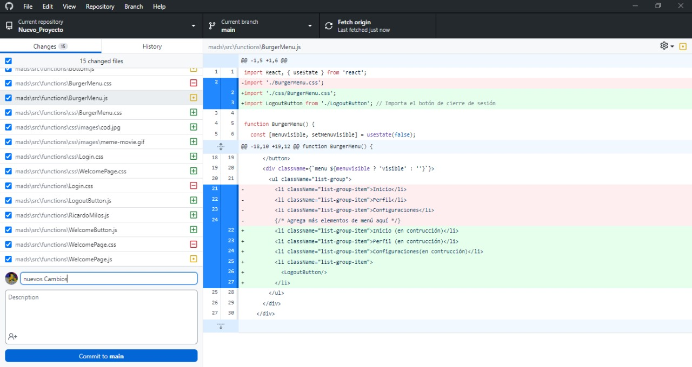

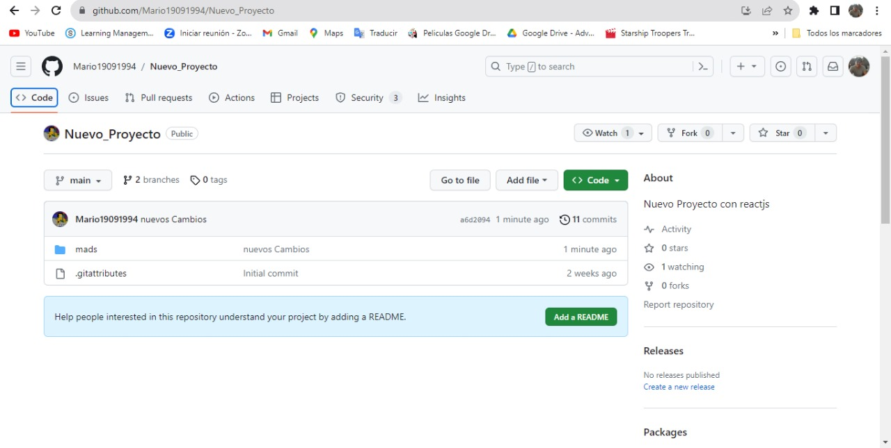
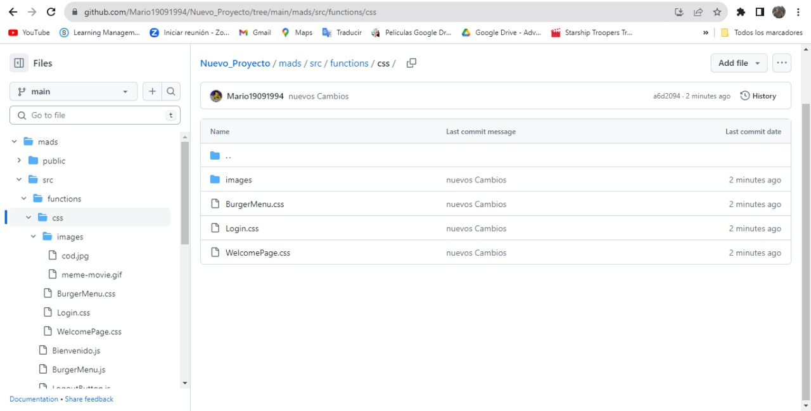
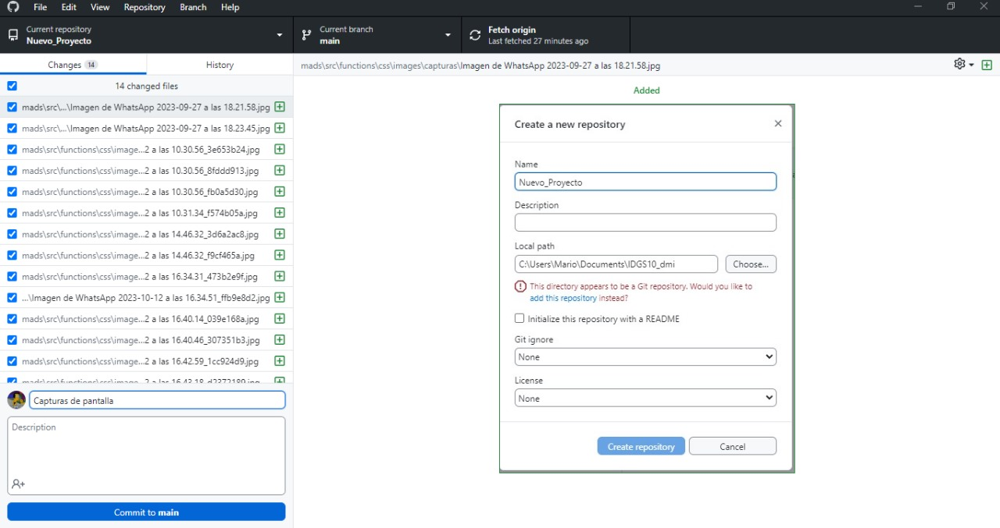
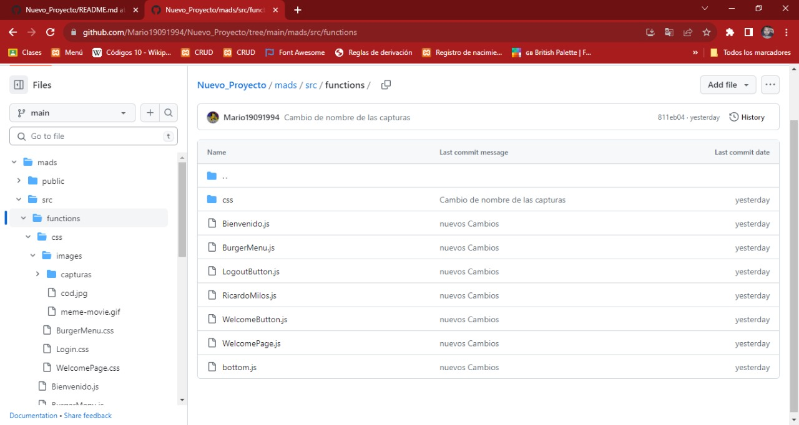

## Sección 4: Capturas de Pantalla del Programa corriendo de forma normal

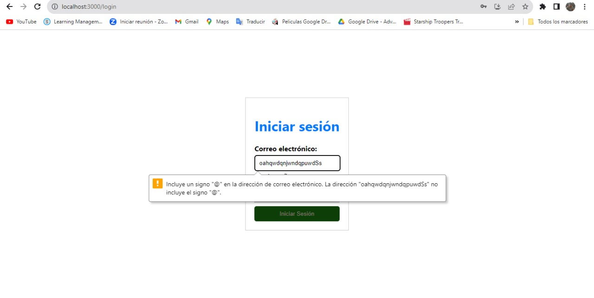
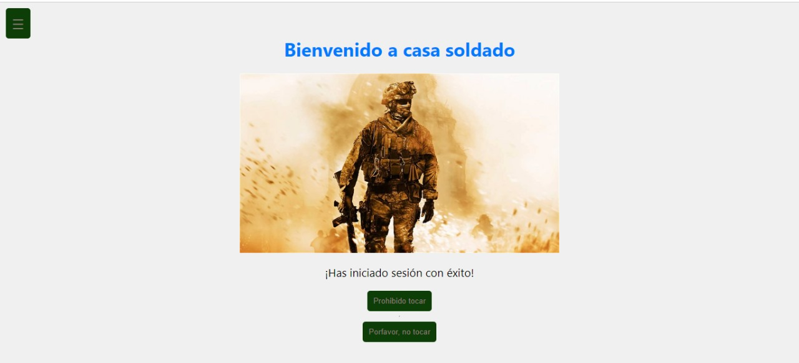

## Sección 4: Capturas de Pantalla del programa corriendo de forma responsiva
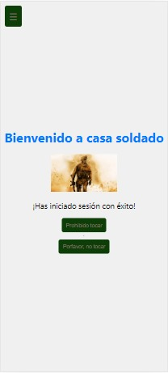
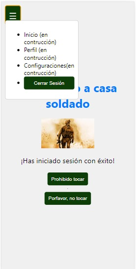

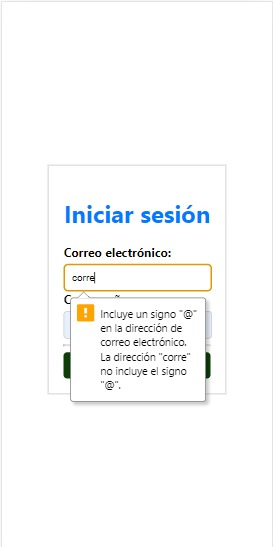

